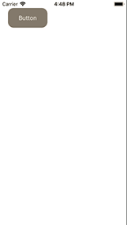

# UIKit Recipes

1. UIButton

1.1 Basic Layout

<p align="center">
   
</p>

```swift
import UIKit

class ViewController: UIViewController {

    override func viewDidLoad() {
        super.viewDidLoad()
        
        let button = UIButton(type: .system)
        button.frame = CGRect(x: 20, y: 20, width: 100, height: 50)
        button.setTitle("Button", for: .normal)
        button.setTitleColor(.white, for: .normal)
        button.backgroundColor = .gray
        button.layer.cornerRadius = 15
        view.addSubview(button)
    }
}
```